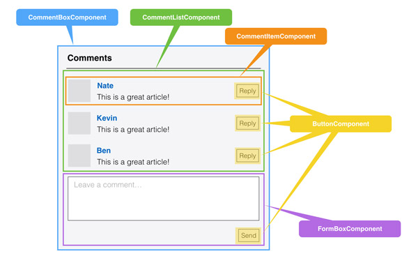
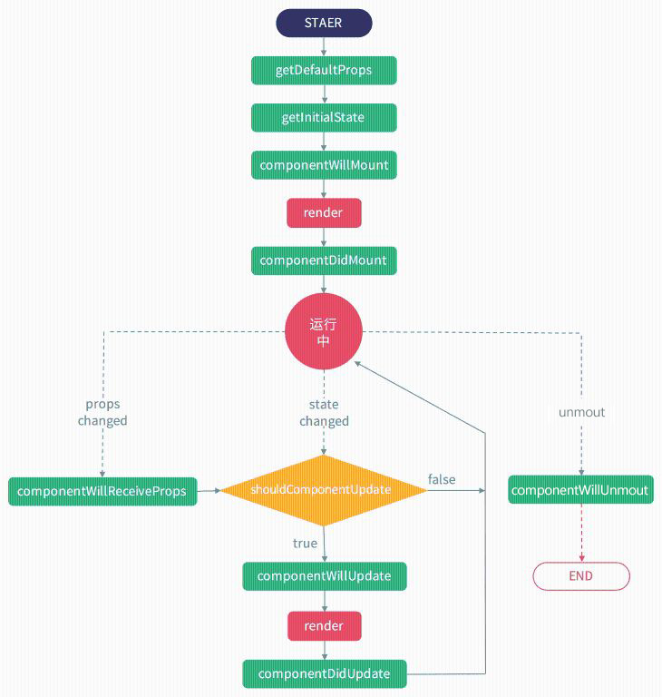
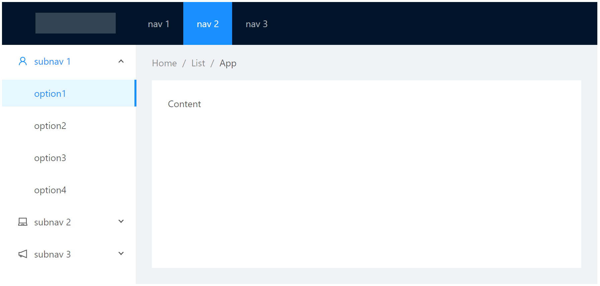

# React

## 了解React
React是一个视图层的框架，起源于 Facebook 的内部项目，因为该公司对市场上所有 JavaScript MVC 框架，都不满意，就决定自己写一套，用来架设 Instagram 的网站。做出来以后，发现这套东西很好用，就在2013年5月开源了。由于 React 的设计思想极其独特，属于革命性创新，性能出众，代码逻辑却非常简单。所以，越来越多的人开始关注和使用，认为它可能是将来 Web 开发的主流工具。

React官网地址：http://facebook.github.io/react/

### React 特点

* 声明式设计
>React采用声明式，可以轻松描述应用。
* 高性能
>React通过对DOM的模拟(Virtual DOM)，最大限度地减少与DOM的交互。
* 组件化开发
>通过 React 构建组件，使得代码更加容易得到复用，能够**高效率**的应用在大项目的开发中。
* 单向响应的数据流
>React 中的数据是单向自顶向下传递的，React 之所以能胜任大型复杂前端项目的开发，是因为其 单向数据流 这一重要特性
* JSX扩展
>JSX 是 JavaScript 语法的扩展。React 开发不一定使用 JSX ，但我们建议使用它。


## 安装与引入

### script标签引入
* react.js          React 的核心库
* react-dom.js      提供与 DOM 相关的功能
* browser.js        babel针对于浏览器环境的版本，可将JSX、ES6+等语法编译成浏览器支持的代码
>在浏览器中使用 Babel 来编译 JSX为实时编译， 效率是非常低的，一般只用于演示

### 通过脚手架快速搭建React环境

> create-react-app，简称CRA， 是来自于官方 Facebook的脚手架工具，通过该命令我们无需配置就能快速构建 React 开发环境

* 安装create-react-app
```bash
    npm install -g create-react-app
```

* 利用create-react-app创建i项目
```bash
    create-react-app my-app
```

### 手动搭建基于Webpack的React环境
> 需要安装以下模块
* react & react-dom
* babel-loader & @babel/core & @babel/preset-react
* webpack & webpack-cli & webpack-dev-server


## 使用

### 渲染

* ReactDOM.render(content,target)
    >是ReactDOM的最基本方法，用于将内容渲染到指定节点中
    - content：可以是HTML标签或 React 组件
    - target：挂载点，必须为元素节点
* React.createElement(type,props,children)
    > 用于创建虚拟节点
    * type: 节点名称
    * props: 节点属性
    * children: 节点内容

### JSX语法
一种特殊的js语法，是ECMAScript的扩展，可以让我们在js代码中直接使用html标签，再通过编译器（Babel）转成标准的 JavaScript 后由浏览器执行。

Babel解析规则：
>分清html标签、组件、js代码

* 遇到 HTML 标签（以 < 开头），就用 HTML 规则解析；
* 遇到代码块（以 { 开头），就用 JavaScript 规则解析；

>注意：
* 因为Javascript代码与JSX代码并不兼容，凡是使用JSX的script标签都需要加上 type="text/babel"
* 在jsx代码中，同为js关键字的html属性不能直接使用
    * class -> className,
    * for -> htmlFor
* 属性使用驼峰
    * tabindex -> tabIndex
    * autofocus -> autoFocus
    * onkeydown -> onKeyDown
    * ......
* 必须结束标签（如：`<input type="text"/>`）
* style 属性的值接收一个对象，css 的属性必须为驼峰写法
>style={{"backgroundColor":"#f60"}}
* 花括号`{}`内为js表达式，不允许出现var,let,const等关键字
* 使用js语法注释（如{`/*注释内容*/`}，`//注释内容`）

>PS: JSX不是必须的，它只是`React.createElement(type,[props],[...children])`的语法糖，在我们应用JSX进行开发的时候，其实它最终会转化成React.createElement…去创建元素。


## 面向组件编程

>所谓组件，即封装起来的具有独立功能的UI部件，用来组合成更高级东西的物件，通俗来讲，就是“创建一个新的 HTML 标签”
* 组件名必须大写开头
* 只能包含一个顶层标签



>PS：在开发过程中，要善于观察和抽象。尤其是在项目前期，不要着急写代码，一定要观察项目的原型图或者设计稿，弄懂哪些部分是可以拆分成复用的公共组件的。这样做能让你后面的工作，事半功倍

### 组件定义

#### 函数组件（无状态组件、受控组件、UI组件）
>纯展示组件，这种组件只负责根据外部传入的props来展示，书写更简洁，执行效率更高

- 特点
    - 只根据传入的props属性展示不同的UI效果
    - 组件不会被实例化，整体渲染性能得到提升
    - 组件不能访问this对象
    - 组件无法访问生命周期的方法

>PS：无状态组件被鼓励在大型项目中尽可能以简单的写法来分割原本庞大的组件，未来React也会这种面向无状态组件在譬如无意义的检查和内存分配领域进行一系列优化，所以只要有可能，尽量使用无状态组件。

```js
    //定义
    function MyComponent(props){
        return <h1>函数组件</h1>
    }

    //使用
    ReactDOM.render(
        <MyComponent myname="laoxie" />,
        document.getElementById('app')
    );
```

#### 类组件（有状态组件、非受控组件、容器组件）
> 类继承组件有更丰富的特性（state状态、生命周期等）

```js
    class About extends React.Component{
        constructor(){
            super();
            this.state = {username:'laoxie'}
        }
        render(){
            return <div className="box">类组件{this.state.username}</div>
        }
    }
```

* 组件状态state
    > React类组件拥有自己的状态state，state状态改变时自动执行组件中的render方法渲染视图（自动刷新）

    * 初始状态
    ```js
        class MyComponent extends React.Component {
            constructor() {
                super(); // 这行代码不能少哦
                this.state = {
                    isLiked: false
                }
            }
        }
    ```

    * 修改状态：setState() 
        * 格式：`setState(nextState[,callback])`
            - nextState: 将要设置的新状态，该状态会和当前的state合并
            - callback: 可选参数，回调函数。该函数会在setState设置成功，且组件重新渲染后调用。

        * 依赖上次setState的结果
        >格式：`setState(fn [,callback])`
            * fn(prevState)

            ```js
                this.setState(prevState=>{
                    return {num:prevState.num+1}
                })
            ```
        * 多次setState()合并
        > React内部自动进行state的对比，得到最终结果后才渲染视图，所以并不需要担心多次进行 setState 会带来性能问题

        >PS：调用setState()并不会马上修改 state。而是进入到一个更新队列里面，所以不能在组件内部通过`this.state.xx=xx`直接修改状态，因为修改后会被队列中的setState()替换（如下两次输出都为false）

        ```js
            console.log(this.state.isLiked);//false
            this.setState({
                isLiked: true
            });
            console.log(this.state.checked);//false
        ```

* 强制更新组件
> 格式：forceUpdate(callback)

`this.forceUpdate()`方法会使组件调用自身的render()方法重新渲染组件，组件的子组件也会调用自己的render()，一般来说，应该尽量避免使用forceUpdate()


### 组件通讯

#### 父传子：props

> props是一个对象，包含使用组件时的所有属性，属性必须为只读的，这一点非常重要，请严格遵守

* 获取方式
    - 函数组件：通过参数props访问
    - 类组件：通过this.props访问

* props默认值：defaultProps
>通常情况下，我们需要为组件的某些属性设定默认值。就像 HTML 标签的属性也有默认值一样，（如 form 标签的 method 属性默认值是 GET，input 标签的 type 属性默认值是 text ）

    ```js
        MyComponent.defaultProps = {
          name: 'laoxie'
        }

        //ES6写法
        // ES6默认不支持静态属性，需安装@babel/plugin-proposal-class-properties
        static defaultProps = {
            name: 'laoxie'
        }
    ```

* props类型校验
    > 给组件设置静态属性 propTypes 来设置组件各个属性的类型检查器, 用于限制传入属性的数据类型

    * React 内置数据类型检查器PropTypes
    >在React 16版本之后, PropTypes 从react包 分离到了prop-types 包中
    ```js
        import PropTypes from 'prop-types';
        MyComponent.propTypes = {
            name: PropTypes.string
        }
    ```

    * 自定义属性验证器
    ```js
        MyComponent.propTypes = {
            //自定义验证规则
            age:(props,propName,comName)=>{
                if(props[propName]<18){
                    return new Error(propName + '必须大于等于18岁');
                }
            }
        }
    ```

#### 子传父
> 把父组件函数传递到子组件执行的方式

#### 多层次组件通讯

* props逐层传递
    > 从上到下，所有的组件都要帮助传递这个 props到目标位置
    * 缺点：
        - 操作繁琐
        - 难以维护


* context组件共享
    > 所谓context，就是**上下文环境**，某个组件只要往自己的 context 里面放了某些状态，这个组件之下的所有子组件都能直接访问这个状态

    * 实现步骤
        1. 创建Context：
            ```js
                let defaultValue = {username:'laoxie'}
                let MyContext = React.createContext(defaultValue)
            ```
        2. 父组件Provider
            ```js
                let data = {username:'jingjing'}
                <MyContext.Provider value={data}>
                    //...
                </MyContext.Provider>
            ```
            >如父组件未设置Provider，子组件接收时得到defaultValue
        3. 子组件接收
            * contextType
                > 只适用于类组件，通过`this.context`获取
                ```js
                    SubComponent.contextType = MyContext;

                    this.context.username;//jingjing
                ```
            * Consumer
                ```js
                    <MyContext.Consumer>
                        {value =>{
                            // 回调函数中获取value值
                            } 
                        }
                    </MyContext.Consumer>
                ```

#### 组件内容通讯
* props.children
    >获取双标签组件的内容，返回值如下（可利用 React.Children对象下的方法进行操作）
    * 无内容：Undefined
    * 文字内容：String
    * 单个标签：Object
    * 多个标签：Array

* Render Props
> 任何被用于告知组件需要渲染什么内容的函数 prop 在技术上都可以被称为 “render prop”
```js
    function MyComponent(props){
        return {props.render()}
    }
    <MyComponent render={()=><button>点我</button>}/>
```

### 高阶组件HOC（High Order Component）

* 高阶组件是一个纯函数
* 高阶组件的参数为组件，返回值为新组件
* 高阶组件是一种设计模式，类似于装饰器模式

#### 使用场景

* 操纵 props
* 通过 ref 访问组件实例
* 组件状态提升
* 用其他元素包装组件

#### 使用

* 定义一个HOC
```js
    //utils/withStorage.js
    import React, { Component } from 'react'
    const withStorage = WrappedComponent => {
        return class extends Component{
            componentWillMount() {
                let data = localStorage.getItem('data')
                this.setState({ data })
            }

            render() {
                return <WrappedComponent data={this.state.data} {...this.props} /> 
            }
        }
    }
    export default withStorage
```

* 在组件中使用HOC
```js
    //components/Home.js
    import React, { Component } from 'react'
    import withStorage from '@/utils/withStorage'

    class Home extends Component{
        render() {
            //通过高阶组件可以直接获取data
            return <h2>{this.props.data}</h2>
        }
    }
    export default withStorage(Home)
```

* ES7`@`装饰器写法
```js
    import React, { Component } from 'react'
    import withStorage from '@/utils/withStorage'

    @withStorage
    class Home extends Component{
        render() {
            return <h2>{this.props.data}</h2>
        }
    }

    export default Home
```
>PS：需安装@babel/plugin-proposal-decorators插件

## 列表渲染&key

使用 JavaScript 的 map() 方法来创建列表

### key

>react利用key来区分组件的
    * 相同的key表示同一个组件，react不会重新销毁创建组件实例，只可能更新；
    * key不同，react会销毁已有的组件实例，重新创建组件新的实例
* key应该是稳定唯一的，尽量不要用数组的索引index作为key（排序或添加时索引值会改变）

## 事件处理
> 采用驼峰式写法（如：onClick,onKeyDown）

### event对象与传参

* 默认绑定方式
    + 事件处理函数的第一个参数为event对象（与原生js一致）
    + 无法传递其他参数
    ```js
        //定义
        clickHandle(e){
            console.log(e);
        }

        //使用
        <button onClick={this.clickHandle}>按钮</button>
    ```
* bind方式
    + event对象会在所有参数后隐式传递
    ```js
        //定义
        clickHandle(num1,num2,e){
            console.log(num1,num2,e);
        }

        //使用
        <button onClick={this.clickHandle.bind(this,10,20)}>按钮</button>
    ```
* 使用箭头函数调用
    + event对象需要手动传递
    + 可以传递其他参数
    ```js
        //定义
        clickHandle(e,num){
            console.log(e,num);
        }

        //使用
        <button onClick={e=>this.clickHandle(e,10)}>按钮</button>
    ```

### 事件处理函数中的this指向

```js
    <button onClick={this.clickHandle}>按钮</button>
```

>以上clickHandler被调用时，内部的this不指向组件实例，也不指向button元素，而是得到undefined，如果需要用到this需要使用以下方式改变this指向

* bind方法
    * 执行时bind
    * 初始化时bind (推荐)
    ```js
        class MyComponent extends React.Component{
            constructor(props){
                super(props);
                this.clickHandle = this.clickHandle.bind(this)
            }
            clickHandle(){

            }
        }
    ```
* 使用箭头函数
    * 定义时使用箭头函数
    ```js
        class MyComponent extends React.Component{
            // 需要插件支持：@babel/plugin-proposal-class-properties
            clickHandle = ()=>{
                
            }
        }
    ```
    * 执行时使用箭头函数

## refs

* 应用位置
    * 应用在元素节点上：对节点的引用
    * 应用在组件上：对组件实例的引用
    >函数组件不可使用ref
* 适合使用 refs 的情况：
    * 管理焦点，文本选择或媒体播放
    * 触发强制动画
    * 集成第三方 DOM 库
* 设置方式
    * React.createRef()
    * 回调 Refs 
        > `ref={el=>this.myRef=el}`
```js
    // React.createRef()
    this.btnSave = React.createRef();
    <button ref={this.btnSave}>保存</button>
    //获取节点
    this.btnSave.current

    //回调 Refs
    <button ref={el => {this.btnSave = el}}>保存</button>
    // 获取节点
    this.btnSave
```


## 组件生命周期

>组件的生命周期分成四个状态：
* Initial: 初始化阶段
* Mounting：挂载阶段
* Updating：更新阶段
* Unmounting：卸载阶段




* componentWillMount （不推荐，V17.x版本中将移除）
    >在组件被渲染到页面上之前执行

* componentDidMount 
    >组件被渲染到页面上后立马执行

    - 这个时候是做如下操作的好时机：
        - 某些依赖组件 DOM 节点的操作
        - 发起ajax请求
        - 设置 setInterval、setTimeout 等计时器操作
        - 读取本地存储数据

* componentWillUpdate(nextProps, nextState) （不推荐，V17.x版本中将移除）
    >在初始化时不会被调用，可能在以下两种情况下被调用：
    * 当组件 shouldComponentUpdate 返回 true 且接收到新的props或者state但还没有render时被调用
    * 调用 forceUpdate 时将触发此函数

* componentDidUpdate(prevProps, prevState)
    >在组件完成更新后立即调用。在初始化时不会被调用。

    * 在此处是做这些事情的好时机：
        * 执行依赖新 DOM 节点的操作。
        * 依据新的属性发起新的ajax请求。
        >注意：一定要在确认属性变化后再发起ajax请求，否则极有可能进入死循环：DidUpdate -> ajax -> changeState -> DidUpdate -> ...）

* componentWillUnmount
    >在组件从 DOM 中移除之前立刻被调用。

    * 此处最适合做以下操作
        - 清除定时器、
        - 终止ajax请求


* componentWillReceiveProps(nextProps) （不推荐，V17.x版本中将移除）
    >该方法在以下两种情况下被调用：
    * 组件接收到了新的props属性。新的属性会通过 nextProps 获取到。
    * 组件没有收到新的属性，但是由于父组件重新渲染导致当前组件也被重新渲染。

* shouldComponentUpdate(nextProps, nextState)
    >在props改变或state改变时被调用，必须返回true或false来决定给是否重新渲染组件
    * 在初始化时或者使用forceUpdate时不被调用。
    * 一般用于性能优化

    ```js
         //在render函数调用前判断：如果前后state中num不变，通过return false阻止render调用
        shouldComponentUpdate(nextProps,nextState){
            if(nextState.num == this.state.num){
                return false
            }
        }
    ```

    >PS：这是一个询问式的生命周期函数，如果返回true，组件将触发重新渲染过程，如果返回false 组件将不会触发重新渲染。因此，合理地利用该函数可以一定程度节省开销，提高系统的性能

---

【案例】

* 待办事项todolist

【练习】

* 利用组件布局一个后台管理系统页面，必须包含以下模块
    * Header
        * Logo  标识
        * Nav   主导航
    * Main
        * Side  侧栏
        * Breadcrumb    面包屑导航
        * Content   内容
    * Footer
    <p>
    
    </p>


